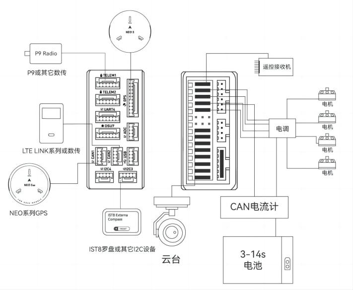
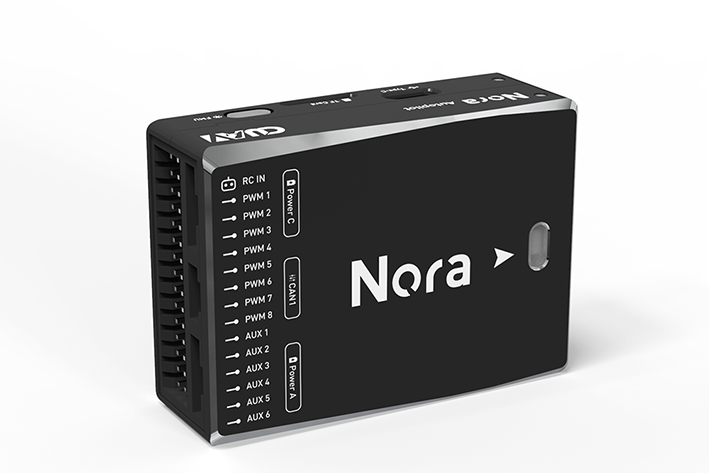
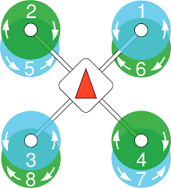
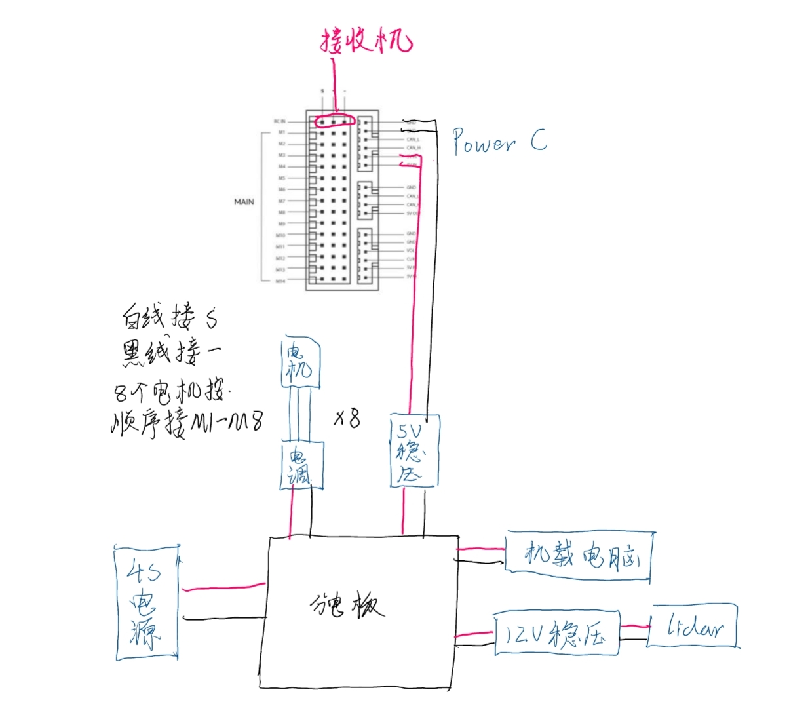

# 无人机组装

## 整体接线

通用无人机接线，在我们项目中不需要一些东西，如数传、图传、GNSS等，具体接线见后续。

## 电机

由于需要搭载较重负载，我们选用8个电机组成x8形无人机，电机需要关注的参数有kv值，对应电压、以及电流。

这是这款电机的参数表：

## 电调

电调选择与电机的电流大小有关，在此用的是这款配套的电调，允许通过20A电流。电调接线见分电板。

该电调不支持dshot协议，所以调整电机转向仅能通过交换电机连接的三相线来解决

## 电源

比赛最大能使用4s的电源，最大16.8V电压，电池的参数主要关注毫安数，以及放电倍率。最大放电电流等于毫安数乘放电倍率，要求该值大于8个电机最大电流总和。

## 遥控

遥控使用左手油门，即美国手，要求遥控器和接受机最少有8通道。

## 飞控

飞控是飞行过程中底层的控制，由它控制飞行的姿态路径等。通过飞控的typc接口连接机载电脑进行高层次的控制。其他接线见分电板

**POWER A**	连接电源PM模块；具有电源输入&AD电压电流检测功能(默认使用该接口）

**POWER C**	请将CAN PMU SE连接到此接口；该接口连接UAVCAN电源模块

**GPS&SAFETY**	连接Neo Gps,它包含GPS、安全开关、蜂鸣器接口

**UART 4**	可用于连接GPS,可作为第二个GPS

**TELEM1/TELME2**	连接数传等，用于MAVLINK交互数据

**TF CARD**	插入SD卡，可实现日志存储功能

**M1~M14**	PWM信号输出口，可用于控制电机或舵机；并且M1~M12还支持dshot协议

**DSU7**	用于FMU芯片调试，读取DEBUG设备信息

**TYPE-C(USB)**	连接电脑，用于飞控与电脑的通信，比如烧录固件

**USB**	连接电脑，用于飞控与电脑的通信，比如下载日志

**I2C1/I2C2/i2C4**	连接外置指南针等I2C设备，用于飞控与I2C设备的通信

**CAN1/CAN2**	连接CAN GPS等UAVCAN设备，用于飞控与UAVCAN设备的通信（比如连接NEO V2 pro uavcan GPS)

**RC IN**	包含DSM、SBUS、RSSI信号输入接口，DSM接口可以连接DSM卫星接收机、SBUS接口连接SBUS遥控器接收机

**RSSI**	用于连接信号强度回传模块

## 桨叶

由于采用八轴无人机，各桨叶转向如下。

## 分电板

分电板将总电源分到各个模块，要求能通过的最大电流尽可能较大，实际我们的接线如下。

